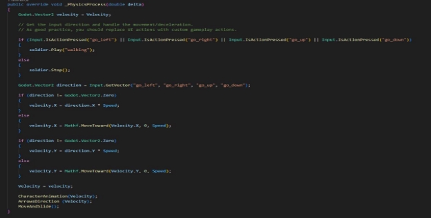
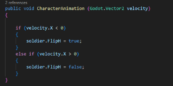
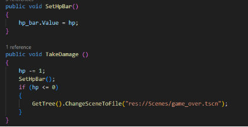
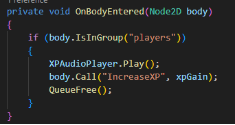
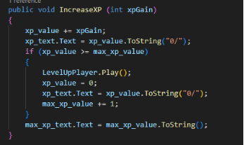
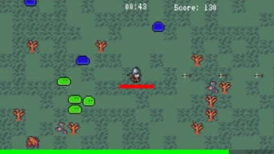
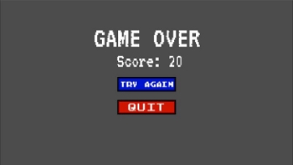
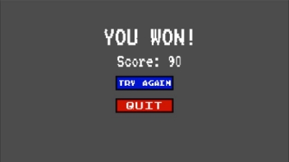

Документација за проектот 

„Bulletheaven Game“ 

Александар Ѓорѓиевски 213276 

1. **Опис на играта:** 

Играта која решив да ја имплементирам е инспирирана од популарниот хит Vampire Survivors. Во играта има непријатели кои се движат кон играчот. Играчот се движи со помош на копчињата WASD. Целта на играчот е да преживее 3 минути со цел да ја победи играта. Непријателите стануваат сѐ  посилни и посилни, како тече времето.  Ако, играчот стапи во контакт со било кој од непријателите, тој губи дел од неговиот HP (hit points), ако тој го изгуби целиот HP тогаш играчот губи и играта завршува. 

2. **Податоци во играта** 

За играта се чуваат слики кои се користени за претставување на играчот, анимациите на играчот, за непријателите и за градење на целиот свет. Исто така се користени и аудио ефекти за удирање на непријател, за собирање на XP и музика. За овозможување на движење на играчот или пак движење на непријателите, како и за сите други останати јазли, се користат скрипти за целата логика. Па, така за чување на HP на играчот или неговиот score, се прави скрипта, која ќе е поврзана со телото на играчот. 

*Слика 1: Тело на играчот, со додадена* 

*скрипта* 

Оваа се прави за секој јазол, кој треба да има некоја своја логика или пак да се чуваат информации за истиот.  

3. **Класа на играчот** 

Во класата на играчот имаме две функции кои се направени од страна на Godot. Првата е: public override void \_Ready() {}. Оваа функција се повикува кога јазолот и неговите деца се влезени во сцената и оваа е првата функција која се повикува. Па поради тоа најчесто се користи за иницијализација. 

Втората е: public override void \_PhysicsProcess(double delta) {}. Оваа функција најчесто се користи за имплементирање на физика во играта. На пример, јас оваа функција ја имам искористено за движење на играчот со помош на WASD со одредена брзина.  

*Слика 3: Движење на играчот и прикажување на анимација за движење* 

Во сликата може да се забележат и други функции кои ќе бидат подетално објаснети. 

Во играта за да може да се извршува анимацијата за движење на играчот, може да ја користиме брзината на движење на играчот за да одредиме на која страна да го свртиме спрајтот на играчот.  

*Слика 4: Одредување на насока на спрајтот според брзината на играчот*

Исто така брзината на движењето може да ја искористиме и за одредување на насоката на движење на стрелите во играта.  

Во класата за играчот имаме и логика за поставување на HP на  ProgressBar и исто така логика за одземање на HP на играчот. Кога HP на корисникот ќе биде помало или еднакво на 0, тогаш ќе се покаже Game Over сцената. 

\_\_\_ 

*Слика 5: Поставување на HP na ProgressBar и за одзимање на HP* 

Функцијата за зголемување на XP (experience) е поврзана со помош на сигнал со површината на XP gems.   

*Слика 6: Сигнал во XP gems*

Додека пак во класата за играчот се зголемува XP на играчот и кога ќе достигне одредена граница, тогаш се зголемува нивото на играчот. 

*Слика 7: Код за зголемување на XP и ниво на играчот* 

4. **Изглед и упатсво за користење** 

Првин со цел да ја започнете играта, истата ќе треба да ја отворите со помош на Bulletheaven-Game.exe. Кога ќе ја отворите играта тогаш за да започнете со играње ќе треба да кликнете на копчето за започнување на играта. 

*

*Слика 8.1: Сцена за започнување на играта*

Кога ќе се вклучи играта, за да го контролирате карактерот, ги користите копчињата: W – за одење нагоре, S – за одење надолу, A – за одење налево, D – за одење надесно. Во зависност на која насока гледате во таа насока ќе стрелате. Со секој уништен непријател, добивате одреден score, во зависност од нивната тежина.

*Слика 8.2: Изглед на играта* 

Ако вашиот HP биде нула, тогаш ќе се покаже сцената за изгубена игра.  

*

*Слика 8.3: Излед за сцена кога ќе изгубите*

Додека пак ,ако успеете да преживеете доволно, тогаш ќе се покаже сцената за победа.  

*Слика 8.4: Сцена за победа* 

Credits:

Sound effects:

Slime Death (1) by DrMinky -- https://freesound.org/s/167074/ -- License: Attribution 4.0
Retro Coin Collect by DrMinky -- https://freesound.org/s/166184/ -- License: Attribution 4.0
LevelUp.wav by Kenneth_Cooney -- https://freesound.org/s/609335/ -- License: Creative Commons 0

Music:

Minstrel's Song by Keys of Moon | https://soundcloud.com/keysofmoon
Music promoted by https://www.chosic.com/free-music/all/
Creative Commons CC BY 4.0
https://creativecommons.org/licenses/by/4.0/